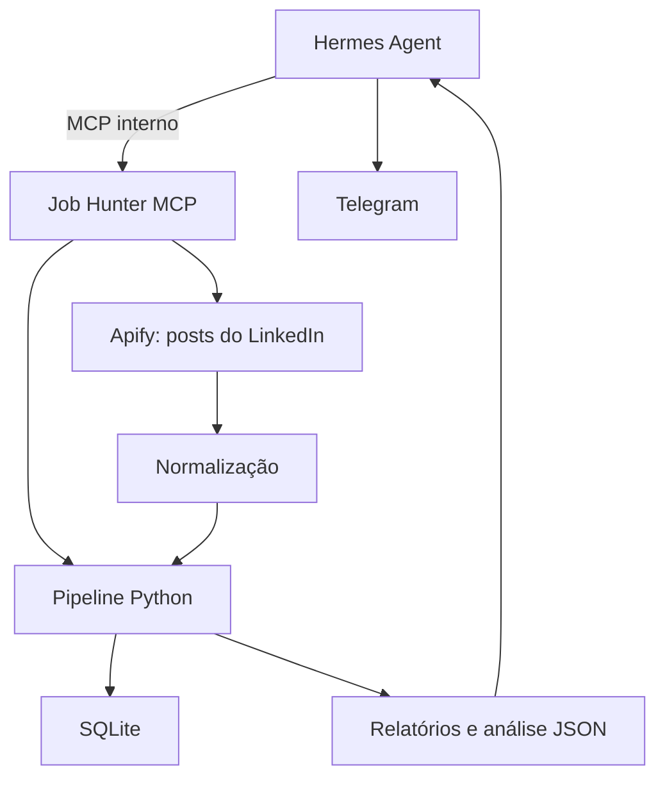

# Agente Caçador de Vagas com Hermes Agent e MCP

## 1. Visão geral

Este documento especifica um assistente automatizado de descoberta, triagem e
preparação de candidaturas. O Hermes Agent atua como orquestrador e cliente MCP;
regras críticas como filtro temporal, deduplicação, validação e geração de
arquivos são implementadas deterministicamente em Python.

A arquitetura roda em containers Docker. A candidatura permanece
*human-in-the-loop*: o sistema recomenda, prepara os materiais e notifica, mas
não envia uma candidatura sem confirmação explícita.

## 2. Objetivos

### 2.1 Isolamento

- Executar Hermes, MCP e módulos Python em containers.
- Montar somente os diretórios necessários.
- Não expor o MCP na rede do host.
- Manter segredos fora da imagem e do repositório.

### 2.2 Filtro temporal rígido

- Considerar apenas vagas publicadas nas últimas 48 horas, ou no limite
  configurado em horas.
- Exigir datas com timezone.
- Descartar datas futuras com tolerância máxima de 15 minutos para diferença de
  relógio.
- Registrar o descarte e seu motivo para auditoria, sem apagar o histórico.

### 2.3 Navegação controlada

- Preferir APIs, feeds estruturados e integrações permitidas.
- Usar navegador automatizado apenas quando necessário e dentro dos termos da
  plataforma.
- Interromper o fluxo diante de CAPTCHA, bloqueio, autenticação adicional ou
  solicitação de confirmação.
- Não implementar contorno de CAPTCHA, evasão de controles ou mecanismo para
  esconder automação.

### 2.4 Otimização ATS fiel

- Comparar a vaga com um currículo-base imutável.
- Reordenar e destacar apenas competências e experiências que existam na base.
- Nunca inventar tecnologias, cargos, métricas, formações ou resultados.
- Produzir PDF textual, simples e legível por ATS.
- Registrar quais trechos foram alterados e quais fatos da base justificam cada
  alteração.

### 2.5 Notificação com revisão humana

- Enviar ao Telegram o relatório diário com vagas, links, score e ajustes
  factuais propostos.
- Anexar o currículo preparado quando a fase de PDF ATS estiver implementada.
- Separar requisitos atendidos, lacunas e informações desconhecidas.
- Exigir confirmação antes de qualquer candidatura.

## 3. Entradas

Todos os arquivos ficam em `workspace/inputs/`.

### 3.1 `config_busca.json`

```json
{
  "filtros_busca": {
    "palavras_chave": [
      "Desenvolvedor Python",
      "Engenheiro de Software",
      "Desenvolvedor Frontend",
      "Desenvolvedor Backend",
      "Desenvolvedor Full Stack",
      "Desenvolvedor Front-end",
      "Python",
      "FastAPI",
      "Django",
      "React",
      "Next.js",
      "NextJS",
      "JavaScript",
      "TypeScript"
    ],
    "localidade": "Brasil",
    "modalidade": "Remoto",
    "tempo_maximo_publicacao_horas": 48
  },
  "plataformas_ativas": {
    "linkedin": true,
    "gupy": true
  },
  "automacao": {
    "navegacao_controlada": true,
    "interromper_em_captcha": true,
    "notificar_via_telegram": true,
    "tentar_auto_apply_simplificado": false,
    "dry_run": false
  },
  "linkedin_posts": {
    "ativo": true,
    "consultas": [
      "\"estamos contratando\" AND (Python OR FastAPI OR Django)",
      "(vaga OR oportunidade) AND (Python OR \"engenheiro de software\")",
      "(vaga OR oportunidade) AND (React OR Next.js OR frontend)",
      "(contratando OR oportunidade) AND (JavaScript OR TypeScript)",
      "(vaga OR contratando) AND (remoto OR \"trabalho remoto\") AND frontend"
    ],
    "ordenar_por": "date",
    "maximo_por_consulta": 5,
    "sinais_contratacao": [
      "vaga",
      "vagas",
      "oportunidade",
      "oportunidades",
      "contratando",
      "estamos contratando",
      "processo seletivo",
      "venha para o time",
      "posição aberta"
    ]
  },
  "analise_semantica": {
    "ativa": true,
    "prompt_version": "semantic-v2",
    "provedor": "nvidia",
    "modelo": "z-ai/glm-5.2",
    "limiar_aplicar": 75,
    "limiar_revisar": 50
  },
  "resumo_diario": {
    "ativo": true,
    "agendamento_cron": "0 8 * * *",
    "fuso_horario": "America/Recife",
    "maximo_analises_por_execucao": 20
  }
}
```

Regras:

- `tempo_maximo_publicacao_horas` deve estar entre 1 e 168.
- `interromper_em_captcha` deve permanecer `true`.
- `tentar_auto_apply_simplificado` permanece `false` durante o MVP.
- `dry_run` separa banco e outputs de teste dos dados persistentes.
- Cada consulta de `linkedin_posts` aceita no máximo 85 caracteres.
- `maximo_por_consulta` limita itens e o teto financeiro é configurado
  separadamente; comentários e reações permanecem desativados no conector.
- `prompt_version` e o hash do currículo identificam uma execução da análise.
- `limiar_revisar` deve ser menor que `limiar_aplicar`.
- `agendamento_cron` usa cinco campos e o fuso deve ser um identificador IANA.
- O cron real só é criado pelo Hermes depois da confirmação do usuário.

### 3.2 `curriculo_base.md`

Markdown limpo com dados reais do usuário. Ele é a única fonte autorizada para
informações pessoais, experiência, formação e competências utilizadas no
currículo otimizado.

O repositório contém apenas `curriculo_base.example.md`.
`curriculo_base.md` é criado localmente, fica no `.gitignore` e nunca deve ser
forçado para o Git. Para reduzir exposição ao modelo, nome e contato antes da
primeira seção `##` não entram nos fatos usados na análise.

### 3.3 Segredos

Os seguintes valores são fornecidos por `.env` ou mecanismo externo de
segredos e nunca são versionados:

- chave do provedor de LLM;
- token e usuários permitidos do Telegram;
- credenciais de conectores autorizados;
- token da Apify;
- chaves de APIs de terceiros.

Cookies de sessão, caso uma integração futura realmente os exija, devem ficar em
volume dedicado, com permissões restritas e ciclo de vida documentado. Eles
nunca entram na imagem, em logs ou no prompt do modelo.

## 4. Modelo normalizado de vaga

Todos os conectores devem produzir este contrato antes da triagem:

```json
{
  "id_externo": "linkedin-123456",
  "plataforma": "linkedin",
  "cargo": "Python Developer",
  "empresa": "Empresa X",
  "localidade": "Brasil",
  "modalidade": "Remoto",
  "descricao": "Descrição completa da vaga",
  "url": "https://exemplo.com/vagas/123456",
  "publicada_em": "2026-07-26T09:30:00-03:00",
  "coletada_em": "2026-07-26T12:00:00-03:00",
  "origem": "anuncio",
  "autor_nome": null,
  "autor_url": null
}
```

A chave de deduplicação é `(plataforma, id_externo)`. Se uma fonte não fornecer
ID estável, o conector deverá gerar um hash da URL canônica. Posts sociais usam
`origem: post_linkedin` e preservam autor e perfil quando disponíveis. Cargo,
empresa, localidade e modalidade inferidos do texto devem ser confirmados no
link antes da candidatura.

## 5. Persistência e idempotência

O MVP usa SQLite em `workspace/state/`.

Cada vaga registra:

- identificadores e URL;
- status `qualificada` ou `descartada`;
- motivo do descarte;
- datas de publicação, coleta, primeira e última visualização;
- payload normalizado usado na decisão.

O modo de teste usa `vagas-dry-run.db`; a execução persistente usa
`vagas-producao.db`. Assim, testes não consomem vagas que ainda precisam ser
processadas no fluxo real.

As análises ficam em tabela separada, sem alterar o status da triagem. Sua chave
é `(plataforma, id_externo, prompt_version, curriculo_sha256)`. Uma mudança no
currículo ou na versão do prompt faz a vaga voltar à fila e preserva o
resultado anterior para auditoria.

## 6. Saídas

Para evitar colisões quando uma empresa publica várias vagas, a estrutura é:

```text
workspace/outputs/
└── [ambiente]/
    └── [AAAA-MM-DD]/
        ├── Relatorio_Diario.md
        └── [empresa]/
            └── [cargo-id-da-vaga]/
                ├── Relatorio_Match.txt
                ├── Analise_Semantica.json
                ├── Sugestoes_Curriculo.md
                ├── Curriculo_Otimizado.pdf
                └── manifest.json
```

### 6.1 `Relatorio_Match.txt`

Deve informar:

- cargo, empresa, plataforma e idade da vaga;
- requisitos atendidos com evidências do currículo-base;
- lacunas e informações desconhecidas;
- palavras-chave destacadas;
- justificativa da recomendação;
- taxa de compatibilidade e método de cálculo.

O relatório nasce com a triagem determinística e marca a análise semântica como
pendente. Depois que o Hermes salva a avaliação, o mesmo arquivo recebe score,
recomendação, requisitos, lacunas e o texto de cada fato citado.

`Analise_Semantica.json` preserva o contrato estruturado completo, incluindo
provedor, modelo, versão do prompt e hash do currículo.

`Sugestoes_Curriculo.md` registra cada proposta de destaque, reordenação ou
reescrita, os IDs `cv-*` usados e o texto original. Ele não altera o
currículo-base.

### 6.2 `Relatorio_Diario.md`

Consolida as análises salvas na data local configurada. Deve incluir cargo,
empresa, link, score, recomendação, requisitos, lacunas, palavras-chave ATS e
ajustes factuais. O gateway do Hermes o envia usando `MEDIA:/workspace/...`.

### 6.3 `Curriculo_Otimizado.pdf`

PDF gerado com `fpdf2`, sem colunas, gráficos, ícones, barras de nível ou
elementos que prejudiquem a leitura por ATS. A geração do PDF será bloqueada se
o conteúdo não puder ser rastreado até o currículo-base. Esta saída permanece
pendente.

### 6.4 Notificação

```text
📊 RELATÓRIO DIÁRIO — 3 vagas analisadas
✅ Aplicar: 1
🔎 Revisar: 2
⛔ Não aplicar: 0
📂 Relatorio_Diario.md anexado para revisão
```

## 7. Arquitetura



Responsabilidades:

| Componente | Responsabilidade |
| --- | --- |
| Hermes Agent | Orquestra ferramentas, realiza análise semântica e conversa com o usuário |
| Job Hunter MCP | Expõe uma superfície mínima e tipada ao Hermes |
| Conector Apify | Pesquisa posts públicos e normaliza os dados do Actor permitido |
| Pipeline Python | Filtra, deduplica, persiste e gera artefatos |
| SQLite | Garante auditoria e idempotência |
| Telegram | Canal do gateway Hermes para chat e entrega agendada |

O MCP usa Streamable HTTP apenas na rede interna do Compose. O manifesto real do
Hermes é `config/hermes/config.yaml`, pois o Hermes atual lê sua configuração em
YAML.

Na integração de posts, o Hermes enxerga a ferramenta
`scan_linkedin_posts`. O token não entra no prompt. O MCP fixa o Actor
`harvestapi/linkedin-post-search`, desativa comentários e reações, limita os
itens e envia `maxTotalChargeUsd`. O modo `dry-run` isola banco e artefatos, mas
não evita o consumo da chamada externa.

A análise semântica é realizada pelo próprio Hermes com o modelo configurado.
O MCP expõe somente a fila, o contexto factual, o salvamento validado e a
consulta de resultados. O código Python não chama outro LLM: ele estrutura o
currículo em IDs `cv-*`, rejeita referências inexistentes, calcula o score e
persiste os artefatos. Ajustes de currículo também precisam citar IDs válidos.

O MCP ainda expõe um plano de rotina e a compilação do relatório diário. O
Hermes cria o cron somente após confirmação, executa sessões isoladas no fuso
configurado e entrega o arquivo pelo próprio gateway Telegram.

## 8. Pipeline

1. Validar `config_busca.json` e segredos obrigatórios.
2. Consultar conectores habilitados; para posts do LinkedIn, enviar as consultas
   booleanas ao Actor configurado.
3. Normalizar os registros.
4. Deduplicar por plataforma e ID externo.
5. Aplicar filtro temporal antes de qualquer chamada de LLM.
6. Aplicar plataforma e palavras-chave. Para posts sociais, exigir também um
   sinal explícito de contratação; localidade e modalidade desconhecidas são
   preservadas para revisão humana.
7. Persistir qualificadas e descartadas com seus motivos.
8. Listar vagas sem análise para a versão do prompt e hash atuais.
9. Entregar ao Hermes uma vaga e fatos numerados do currículo.
10. Classificar requisitos e propor ajustes citando somente fatos existentes.
11. Validar evidências e ajustes e calcular o score deterministicamente.
12. Persistir análise, relatório individual e sugestões de currículo.
13. Consolidar as análises da data em `Relatorio_Diario.md`.
14. Entregar o relatório ao Telegram pelo gateway Hermes.
15. Gerar currículo e manifesto de rastreabilidade em etapa futura.
16. Aguardar revisão humana.

## 9. Segurança

- Privilégios mínimos e rede MCP não publicada.
- Segredos fora de prompts, logs e artefatos.
- Allowlist explícita de usuários do Telegram.
- Ferramentas MCP filtradas com `tools.include`.
- Descrições externas tratadas como dados não confiáveis para reduzir risco de
  *prompt injection*.
- Nenhuma autoaplicação no MVP.
- Nenhum contorno de CAPTCHA ou bloqueio.
- O conector de posts não recebe cookies ou credenciais do LinkedIn.
- Limites de itens e custo são enviados em toda execução do Actor.
- O Hermes só chama a fonte paga mediante pedido explícito ou cron previamente
  confirmado pelo usuário.
- Logs devem registrar decisões, mas não conteúdo sensível do currículo.
- O currículo real é ignorado pelo Git; somente um modelo sem dados pessoais é
  versionado.
- Contextos ficam inválidos quando o hash do currículo muda.

## 10. Observabilidade

Cada execução deverá registrar:

- ID e horário da execução;
- fonte e quantidade descoberta;
- quantidade qualificada, descartada e duplicada;
- descarte agregado por motivo;
- duração por etapa;
- falhas do conector sem segredos;
- artefatos gerados.

## 11. Testes de aceitação do MVP

- Uma vaga com 48 horas exatas ainda é aceita.
- Uma vaga com mais de 48 horas é descartada antes da LLM.
- Um post recente sem indício de contratação é descartado.
- A busca de posts não solicita comentários nem reações.
- Uma execução real do Actor respeita o teto de itens e de custo configurados.
- Datas sem timezone são rejeitadas.
- A mesma vaga não gera dois artefatos no mesmo ambiente.
- `dry-run` não altera o banco de produção.
- Plataforma desativada não é consultada nem processada.
- CAPTCHA interrompe o conector e pede intervenção.
- Nenhum item ausente no currículo-base aparece no currículo otimizado.
- Nome e contato antes da primeira seção profissional não entram no contexto.
- Evidências `cv-*` inexistentes são rejeitadas.
- Ajustes de currículo com IDs `cv-*` inexistentes são rejeitados.
- O score semântico é calculado pelo serviço, não fornecido pelo modelo.
- Alterar o currículo torna a vaga pendente para uma nova análise.
- O relatório diário respeita data e fuso configurados.
- O caminho do anexo existe igualmente no MCP e no Hermes.
- Telegram só envia para IDs na allowlist.
- `auto apply` não pode ser ativado no MVP.

## 12. Cronograma

- [x] Fase 1 — Escopo, arquitetura e contratos revisados.
- [x] Fase 2 — Estrutura física, configuração e dados de teste.
- [x] Fase 3A — Schemas, filtro temporal, SQLite, deduplicação e `dry-run`.
- [x] Fase 3B — MCP inicial e manifesto `config.yaml` do Hermes.
- [x] Fase 4 — Busca de posts públicos do LinkedIn via Apify, com limites.
- [ ] Fase 5 — Conector Gupy com dados estruturados.
- [ ] Fase 6 — Avaliar a aba formal de vagas do LinkedIn com integração
  permitida e pausa em CAPTCHA.
- [x] Fase 7 — Análise semântica e rastreabilidade contra o currículo-base.
- [ ] Fase 8 — Geração do PDF ATS com `fpdf2`.
- [x] Fase 9A — Gateway Telegram e relatório diário em anexo.
- [ ] Fase 9B — Currículo PDF em anexo.
- [x] Fase 10A — Plano e agendamento diário com fuso e limite.
- [ ] Fase 10B — Métricas, testes externos de integração e endurecimento.
- [ ] Fase 11 — Avaliar autoaplicação somente após revisão de risco e termos.
